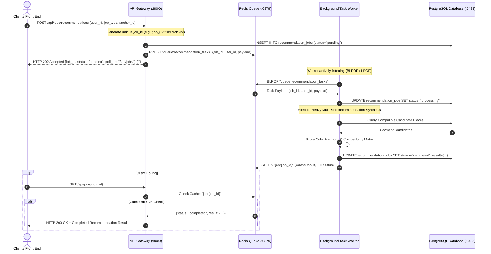

# AURA — Asynchronous Task Processing Flow Diagram

```mermaid
sequenceDiagram
    autonumber
    actor Client as Client / Front-End
    participant Gateway as API Gateway (:8000)
    participant Redis as Redis Queue (:6379)
    participant Worker as Background Task Worker
    participant DB as PostgreSQL Database (:5432)

    Client->>Gateway: POST /api/jobs/recommendations {user_id, job_type, anchor_id}
    Note over Gateway: Generate unique job_id (e.g. "job_82220974dd9b")
    Gateway->>DB: INSERT INTO recommendation_jobs (status="pending")
    Gateway->>Redis: RPUSH "queue:recommendation_tasks" {job_id, user_id, payload}
    Gateway-->>Client: HTTP 202 Accepted {job_id, status: "pending", poll_url: "/api/jobs/{id}"}

    Note over Worker: Worker actively listening (BLPOP / LPOP)
    Worker->>Redis: BLPOP "queue:recommendation_tasks"
    Redis-->>Worker: Task Payload {job_id, user_id, payload}
    Worker->>DB: UPDATE recommendation_jobs SET status="processing"

    Note over Worker: Execute Heavy Multi-Slot Recommendation Synthesis
    Worker->>DB: Query Compatible Candidate Pieces
    DB-->>Worker: Garment Candidates
    Worker->>Worker: Score Color Harmony & Compatibility Matrix

    Worker->>DB: UPDATE recommendation_jobs SET status="completed", result={...}
    Worker->>Redis: SETEX "job:{job_id}" (Cache result, TTL: 600s)

    loop Client Polling
        Client->>Gateway: GET /api/jobs/{job_id}
        Gateway->>Redis: Check Cache: "job:{job_id}"
        alt Cache Hit / DB Check
            Redis-->>Gateway: {status: "completed", result: {...}}
            Gateway-->>Client: HTTP 200 OK + Completed Recommendation Result
        end
    end
```
