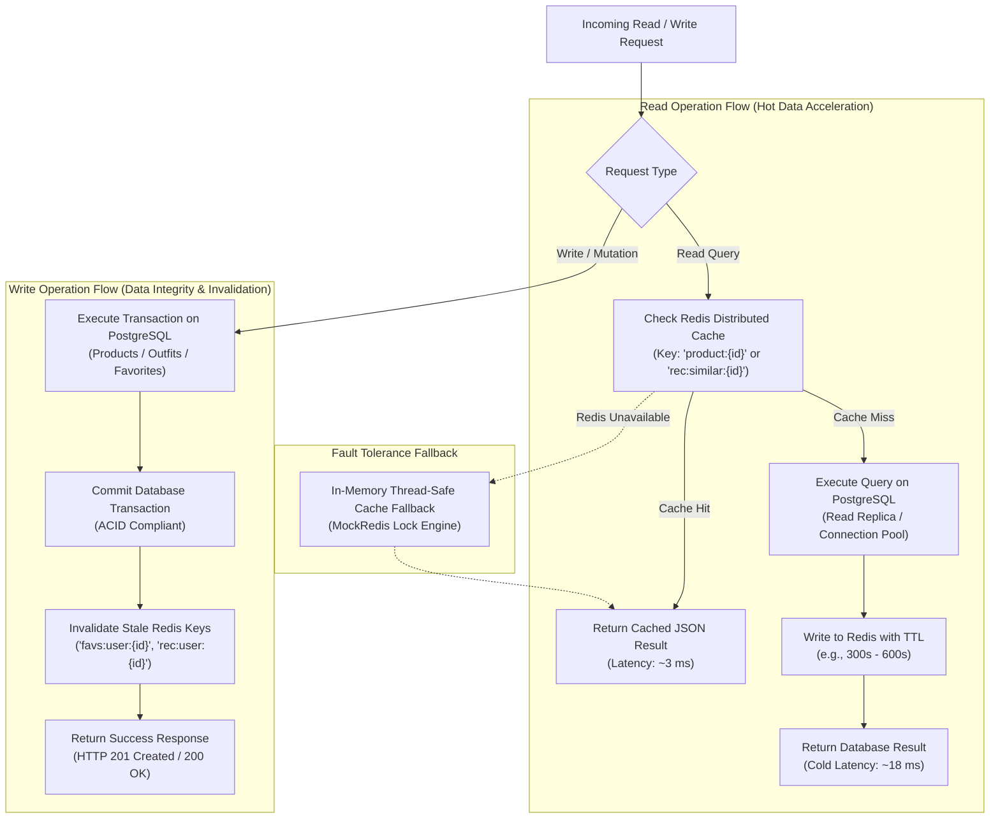

# AURA — Database & Redis Cache Interaction Flow

```mermaid
flowchart TD
    REQ["Incoming Read / Write Request"] --> ROUTE{"Request Type"}

    subgraph ReadPath["Read Operation Flow (Hot Data Acceleration)"]
        ROUTE -->|Read Query| CHECK_CACHE["Check Redis Distributed Cache\n(Key: 'product:{id}' or 'rec:similar:{id}')"]
        CHECK_CACHE -->|Cache Hit| RET_CACHE["Return Cached JSON Result\n(Latency: ~3 ms)"]
        CHECK_CACHE -->|Cache Miss| QUERY_DB["Execute Query on PostgreSQL\n(Read Replica / Connection Pool)"]
        QUERY_DB --> POPULATE_CACHE["Write to Redis with TTL\n(e.g., 300s - 600s)"]
        POPULATE_CACHE --> RET_DB["Return Database Result\n(Cold Latency: ~18 ms)"]
    end

    subgraph WritePath["Write Operation Flow (Data Integrity & Invalidation)"]
        ROUTE -->|Write / Mutation| WRITE_DB["Execute Transaction on PostgreSQL\n(Products / Outfits / Favorites)"]
        WRITE_DB --> COMMIT_DB["Commit Database Transaction\n(ACID Compliant)"]
        COMMIT_DB --> INVALIDATE["Invalidate Stale Redis Keys\n('favs:user:{id}', 'rec:user:{id}')"]
        INVALIDATE --> RET_WRITE["Return Success Response\n(HTTP 201 Created / 200 OK)"]
    end

    subgraph FailureFallback["Fault Tolerance Fallback"]
        CHECK_CACHE -.->|Redis Unavailable| MEM_FALLBACK["In-Memory Thread-Safe Cache Fallback\n(MockRedis Lock Engine)"]
        MEM_FALLBACK -.-> RET_CACHE
    end
```
