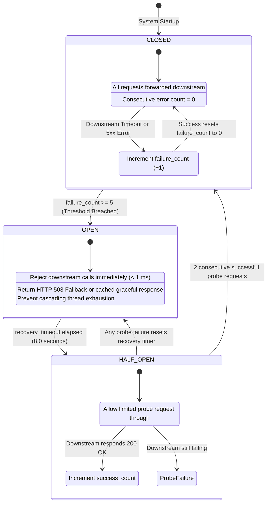

# AURA — Circuit Breaker & Fault Tolerance Recovery Flow

```mermaid
stateDiagram-v2
    [*] --> CLOSED: System Startup

    state CLOSED {
        [*] --> NormalOperation
        NormalOperation: All requests forwarded downstream
        NormalOperation: Consecutive error count = 0
        NormalOperation --> FailureDetected: Downstream Timeout or 5xx Error
        FailureDetected: Increment failure_count (+1)
        FailureDetected --> NormalOperation: Success resets failure_count to 0
    }

    CLOSED --> OPEN: failure_count >= 5 (Threshold Breached)

    state OPEN {
        [*] --> FastFail
        FastFail: Reject downstream calls immediately (< 1 ms)
        FastFail: Return HTTP 503 Fallback or cached graceful response
        FastFail: Prevent cascading thread exhaustion
    }

    OPEN --> HALF_OPEN: recovery_timeout elapsed (8.0 seconds)

    state HALF_OPEN {
        [*] --> ProbeRecovery
        ProbeRecovery: Allow limited probe request through
        ProbeRecovery --> ProbeSuccess: Downstream responds 200 OK
        ProbeSuccess: Increment success_count
        ProbeRecovery --> ProbeFailure: Downstream still failing
    }

    HALF_OPEN --> CLOSED: 2 consecutive successful probe requests
    HALF_OPEN --> OPEN: Any probe failure resets recovery timer
```
