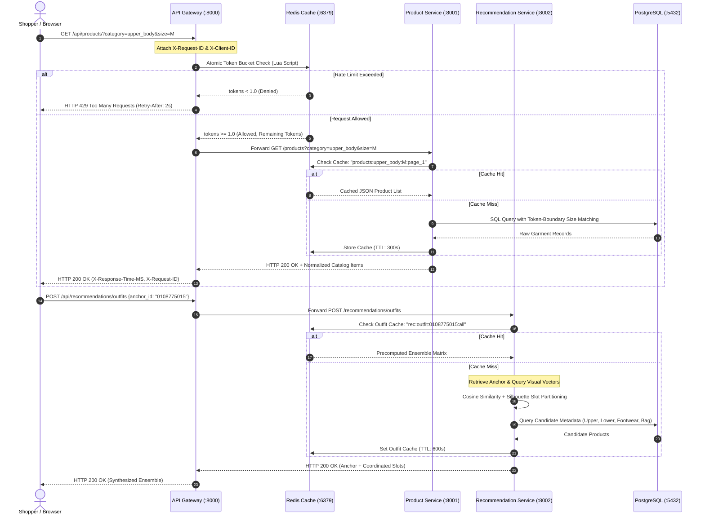

# AURA — API Request-Routing Data Flow Diagram

```mermaid
sequenceDiagram
    autonumber
    actor Shopper as Shopper / Browser
    participant Gateway as API Gateway (:8000)
    participant Redis as Redis Cache (:6379)
    participant ProductSvc as Product Service (:8001)
    participant RecSvc as Recommendation Service (:8002)
    participant Database as PostgreSQL (:5432)

    Shopper->>Gateway: GET /api/products?category=upper_body&size=M
    Note over Gateway: Attach X-Request-ID & X-Client-ID
    Gateway->>Redis: Atomic Token Bucket Check (Lua Script)
    alt Rate Limit Exceeded
        Redis-->>Gateway: tokens < 1.0 (Denied)
        Gateway-->>Shopper: HTTP 429 Too Many Requests (Retry-After: 2s)
    else Request Allowed
        Redis-->>Gateway: tokens >= 1.0 (Allowed, Remaining Tokens)
        Gateway->>ProductSvc: Forward GET /products?category=upper_body&size=M
        ProductSvc->>Redis: Check Cache: "products:upper_body:M:page_1"
        alt Cache Hit
            Redis-->>ProductSvc: Cached JSON Product List
        else Cache Miss
            ProductSvc->>Database: SQL Query with Token-Boundary Size Matching
            Database-->>ProductSvc: Raw Garment Records
            ProductSvc->>Redis: Store Cache (TTL: 300s)
        end
        ProductSvc-->>Gateway: HTTP 200 OK + Normalized Catalog Items
        Gateway-->>Shopper: HTTP 200 OK (X-Response-Time-MS, X-Request-ID)
    end

    Shopper->>Gateway: POST /api/recommendations/outfits {anchor_id: "0108775015"}
    Gateway->>RecSvc: Forward POST /recommendations/outfits
    RecSvc->>Redis: Check Outfit Cache: "rec:outfit:0108775015:all"
    alt Cache Hit
        Redis-->>RecSvc: Precomputed Ensemble Matrix
    else Cache Miss
        Note over RecSvc: Retrieve Anchor & Query Visual Vectors
        RecSvc->>RecSvc: Cosine Similarity + Silhouette Slot Partitioning
        RecSvc->>Database: Query Candidate Metadata (Upper, Lower, Footwear, Bag)
        Database-->>RecSvc: Candidate Products
        RecSvc->>Redis: Set Outfit Cache (TTL: 600s)
    end
    RecSvc-->>Gateway: HTTP 200 OK (Anchor + Coordinated Slots)
    Gateway-->>Shopper: HTTP 200 OK (Synthesized Ensemble)
```
