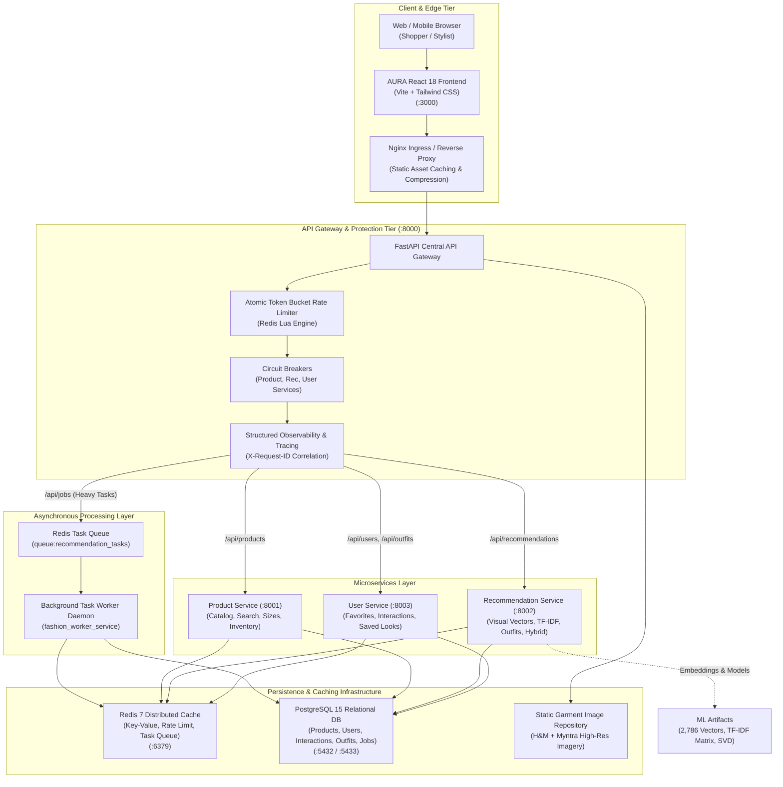

# AURA — High-Level System Architecture Diagram

```mermaid
flowchart TD
    subgraph ClientTier["Client & Edge Tier"]
        BROWSER["Web / Mobile Browser\n(Shopper / Stylist)"]
        UI["AURA React 18 Frontend\n(Vite + Tailwind CSS)\n(:3000)"]
        NGINX["Nginx Ingress / Reverse Proxy\n(Static Asset Caching & Compression)"]
    end

    subgraph GatewayTier["API Gateway & Protection Tier (:8000)"]
        GW["FastAPI Central API Gateway"]
        RL["Atomic Token Bucket Rate Limiter\n(Redis Lua Engine)"]
        CB["Circuit Breakers\n(Product, Rec, User Services)"]
        LOG["Structured Observability & Tracing\n(X-Request-ID Correlation)"]
    end

    subgraph ServiceTier["Microservices Layer"]
        PS["Product Service (:8001)\n(Catalog, Search, Sizes, Inventory)"]
        RS["Recommendation Service (:8002)\n(Visual Vectors, TF-IDF, Outfits, Hybrid)"]
        US["User Service (:8003)\n(Favorites, Interactions, Saved Looks)"]
    end

    subgraph AsyncTier["Asynchronous Processing Layer"]
        RQUEUE["Redis Task Queue\n(queue:recommendation_tasks)"]
        WORKER["Background Task Worker Daemon\n(fashion_worker_service)"]
    end

    subgraph StorageTier["Persistence & Caching Infrastructure"]
        REDIS["Redis 7 Distributed Cache\n(Key-Value, Rate Limit, Task Queue)\n(:6379)"]
        PG["PostgreSQL 15 Relational DB\n(Products, Users, Interactions, Outfits, Jobs)\n(:5432 / :5433)"]
        IMAGES["Static Garment Image Repository\n(H&M + Myntra High-Res Imagery)"]
    end

    BROWSER --> UI
    UI --> NGINX
    NGINX --> GW

    GW --> RL
    RL --> CB
    CB --> LOG

    LOG -->|"/api/products"| PS
    LOG -->|"/api/recommendations"| RS
    LOG -->|"/api/users, /api/outfits"| US
    LOG -->|"/api/jobs (Heavy Tasks)"| RQUEUE

    RQUEUE --> WORKER
    WORKER --> PG
    WORKER --> REDIS

    PS --> PG
    PS --> REDIS

    RS --> PG
    RS --> REDIS
    RS -.->|Embeddings & Models| ML_ARTIFACTS["ML Artifacts\n(2,786 Vectors, TF-IDF Matrix, SVD)"]

    US --> PG
    US --> REDIS

    GW --> IMAGES
```
